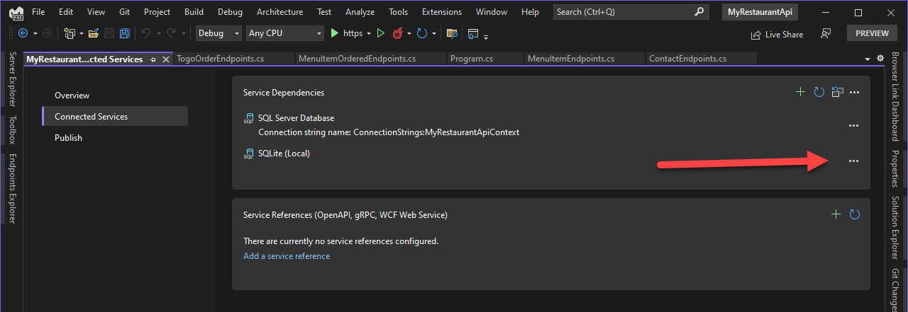
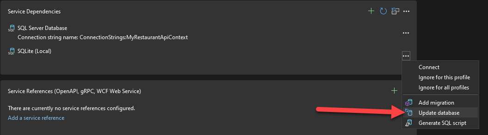

This is a sample ASP.NET Core Web API. Most of the content of the Controllers here was generated with the scaffolding tool in Visual Studio 2022.

This repository contains a sample ASP.NET Core Web API project which was built up using the Scaffolding feature in Visual Studio 2022.

To start from scratch to recreate this sample follow the tutorial at https://devblogs.microsoft.com/visualstudio/web-api-development-in-visual-studio-2022/.

## Building the solution

To get started with this project locally follow the steps outlined below.

1. Clone the repository locally
1. Open the solution `MyRestaurantApi.sln` in Visual Studio 2022 17.6 or later.
1. Update the database (more info below)

### Update the database

This project uses SQLite as a local database. After cloning you'll need to create the database and apply the migrations that are declared in the code.
You can use the integrated Entity Framework tools in Visual Studio 2022 to perform this, or you can use the `dotnet ef` commanand line tool.

#### Create the database using the EF tools in Visual Studio

After opening the solution in Visual Studio 2022, double click on the *Connected Services* node under the `MyRestaurantApi` project. That will open the Connected Services page. From there click on the `...` to the right of the SQLite node. See the following image.

Now click on `Update Database`, see next image.

After this Visual Studio will create the SQLite database and run the migrations to get the database initalized. You can now run the API project.

#### Create the database using `dotnet ef`

If you prefer to use the command line you can use the `dotnet ef` tool to take care of that for you. For more info see the docs at https://learn.microsoft.com/en-us/ef/core/managing-schemas/migrations/?tabs=dotnet-core-cli#create-your-database-and-schema.
